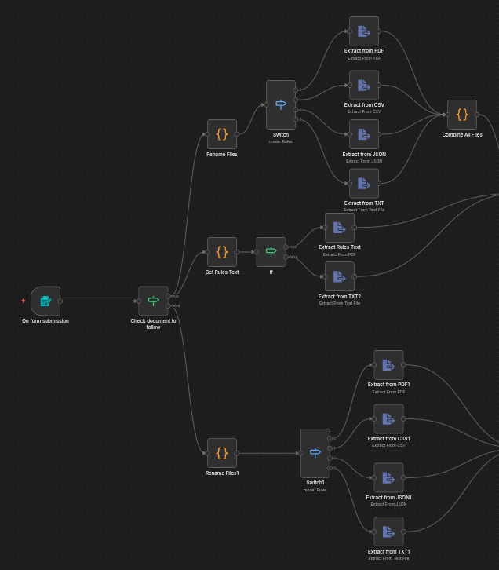
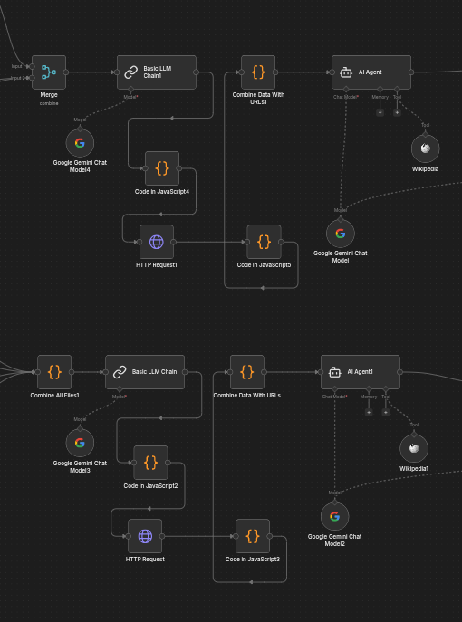
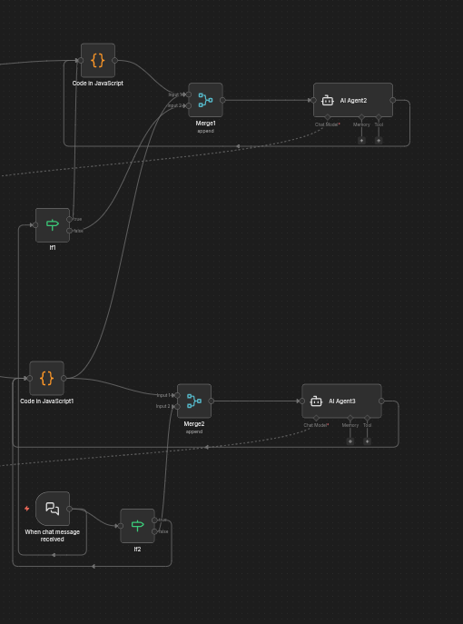

# Agentic course generation

## Table of Contents

- [Prerequisites](#prerequisites)
- [Option A: Docker](#option-a-docker)
  - [Quick start with `docker run`](#quick-start-with-docker-run)
  - [Docker Compose (recommended)](#docker-compose-recommended)
  - [Podman / SELinux notes (Fedora, RHEL)](#podman--selinux-notes-fedora-rhel)
- [Option B: Local installation (npm)](#option-b-local-installation-npm)
- [Creating your account](#creating-your-account)
- [Setting up AI provider credentials](#setting-up-ai-provider-credentials)
  - [OpenAI](#openai)
  - [Anthropic (Claude)](#anthropic-claude)
  - [Google Gemini](#google-gemini)
  - [Ollama (local models)](#ollama-local-models)
  - [Other providers](#other-providers)
  - [Using credentials in a workflow](#using-credentials-in-a-workflow)
- [Useful environment variables](#useful-environment-variables)
- [Updating n8n](#updating-n8n)
- [Troubleshooting](#troubleshooting)

---

## Prerequisites

| Method | Requirements |
| ------ | ------------ |
| Docker | [Docker Engine](https://docs.docker.com/engine/install/) or Docker Desktop (Compose v2 included), or Podman |
| Local  | [Node.js](https://nodejs.org/) — a version supported by n8n (currently Node 20.19 – 24.x; check the [n8n docs](https://docs.n8n.io/hosting/installation/npm/) for the latest range) and npm |

Both methods serve the n8n editor at **http://localhost:5678** by default.

---

## Option A: Docker

Docker is the recommended way to run n8n: it isolates dependencies and makes upgrades easy.

### Quick start with `docker run`

```bash
# Create a persistent volume for n8n data (workflows, credentials, settings)
docker volume create n8n_data

# Start n8n
docker run -it --rm \
  --name n8n \
  -p 5678:5678 \
  -e GENERIC_TIMEZONE="Europe/Skopje" \
  -e TZ="Europe/Skopje" \
  -v n8n_data:/home/node/.n8n \
  docker.n8n.io/n8nio/n8n
```

Open **http://localhost:5678** in your browser.

> **Important:** Always mount a volume at `/home/node/.n8n`. Without it, your workflows,
> credentials, and encryption key are lost when the container is removed.

### Docker Compose (recommended)

Create a project folder with two files:

**`.env`**

```dotenv
# Generate a strong key once and keep it safe, e.g.: openssl rand -hex 32
N8N_ENCRYPTION_KEY=replace-with-a-long-random-string
GENERIC_TIMEZONE=Europe/Skopje
TZ=Europe/Skopje
```

**`docker-compose.yml`**

```yaml
services:
  n8n:
    image: docker.n8n.io/n8nio/n8n:latest
    container_name: n8n
    restart: unless-stopped
    ports:
      - "5678:5678"
    env_file: .env
    environment:
      - N8N_HOST=localhost
      - N8N_PORT=5678
      - N8N_PROTOCOL=http
      - WEBHOOK_URL=http://localhost:5678/
      - N8N_ENFORCE_SETTINGS_FILE_PERMISSIONS=true
    volumes:
      - n8n_data:/home/node/.n8n
    # Lets n8n reach services on the host (e.g. Ollama) via host.docker.internal on Linux
    extra_hosts:
      - "host.docker.internal:host-gateway"

volumes:
  n8n_data:
```

Start, inspect, and stop:

```bash
docker compose up -d        # start in the background
docker compose logs -f n8n  # follow logs
docker compose down         # stop (data stays in the n8n_data volume)
```

> **Keep `.env` out of version control** (add it to `.gitignore`). The
> `N8N_ENCRYPTION_KEY` encrypts every credential you save; if you lose it, saved
> credentials can't be decrypted.


## Option B: Local installation (npm)

### 1. Install Node.js

Use a Node version manager so you can easily match the version n8n supports:

```bash
# Using nvm (https://github.com/nvm-sh/nvm)
nvm install 22
nvm use 22
node --version
```

### 2a. Try it without installing

```bash
npx n8n
```

### 2b. Install globally

```bash
npm install -g n8n
n8n start        # or simply: n8n
```

Open **http://localhost:5678**.

### 3. Configure (optional)

Local installs read the same environment variables as Docker. Export them before starting:

```bash
export N8N_ENCRYPTION_KEY="replace-with-a-long-random-string"
export GENERIC_TIMEZONE="Europe/Skopje"
export N8N_PORT=5678
n8n start
```

Data is stored in `~/.n8n` (SQLite database, config file with the encryption key, etc.).
Back up that folder to keep your workflows and credentials.

---

## Creating your account

The first time you open n8n, it asks you to set up the **owner account**. This is the
administrator of your instance.

1. Go to **http://localhost:5678**.
2. Fill in **email**, **first name**, **last name**, and **password**
   (min. 8 characters, including at least one number and one uppercase letter).
3. Click **Next**. You can optionally answer a short survey or skip it.
4. (Optional) Request a **free license key** when prompted to unlock extra community
   features such as workflow history and debugging tools. It is emailed to you;
   activate it under **Settings → Usage and plan**.

To invite other users later: **Settings → Users → Invite**.

> **Forgot the owner password?** Reset user management from the CLI (this removes all
> users and lets you create the owner again; workflows and credentials are kept):
>
> ```bash
> # Docker
> docker exec -it n8n n8n user-management:reset
> # Local
> n8n user-management:reset
> ```

---

## Setting up AI provider credentials

Credentials are stored encrypted in n8n and can be reused across workflows.

**General steps (for any provider):**

1. In the left sidebar, open **Overview → Credentials** (or click **Create → Credential**).
2. Search for the provider (e.g. "OpenAI").
3. Paste your API key and fill in any other fields.
4. Click **Save**. n8n tests the connection and shows a green "Connection tested successfully" message if it works.

### OpenAI

1. Create a key at <https://platform.openai.com/api-keys>.
2. Make sure your account has billing set up / credits available.
3. In n8n: **Create credential → OpenAI**.
   - **API Key:** `sk-...`
   - **Organization ID:** optional
   - **Base URL:** leave the default (`https://api.openai.com/v1`) unless you use an OpenAI-compatible endpoint.
4. Save.

### Anthropic (Claude)

1. Create a key at <https://console.anthropic.com/settings/keys>.
2. In n8n: **Create credential → Anthropic**.
   - **API Key:** `sk-ant-...`
3. Save. Use it with the **Anthropic Chat Model** node (inside an AI Agent or Chain), or the **Anthropic** node.

### Google Gemini

1. Create a key in Google AI Studio: <https://aistudio.google.com/app/apikey>.
2. In n8n: **Create credential → Google Gemini(PaLM) Api**.
   - **Host:** leave the default (`https://generativelanguage.googleapis.com`)
   - **API Key:** your key
3. Save. Use it with the **Google Gemini Chat Model** node.

> For Vertex AI (Google Cloud) instead of AI Studio, use the **Google Vertex Chat Model**
> node with a Google Service Account credential.

### Ollama (local models)

No API key is needed; n8n just needs to reach the Ollama server.

1. Install Ollama from <https://ollama.com> and pull a model:

   ```bash
   ollama pull llama3.2
   ```

2. In n8n: **Create credential → Ollama**, and set **Base URL**:

   | How n8n runs | Base URL |
   | ------------ | -------- |
   | Local (npm) install | `http://localhost:11434` |
   | Docker, Ollama on the host | `http://host.docker.internal:11434` (requires the `extra_hosts` entry shown in the Compose file) |
   | Docker, Ollama in the same Compose project | `http://ollama:11434` (the service name) |

3. If n8n runs in Docker and Ollama is on the host, Ollama must listen on all interfaces,
   not just `127.0.0.1`. Set `OLLAMA_HOST=0.0.0.0` for the Ollama service, e.g.:

   ```bash
   sudo systemctl edit ollama
   # add:
   # [Service]
   # Environment="OLLAMA_HOST=0.0.0.0"
   sudo systemctl restart ollama
   ```

   Then check that your firewall allows port 11434 from the Docker network.

### Other providers

| Provider | n8n credential | Where to get a key |
| -------- | -------------- | ------------------ |
| Mistral AI | Mistral Cloud | <https://console.mistral.ai/api-keys> |
| Groq | Groq | <https://console.groq.com/keys> |
| OpenRouter | OpenRouter | <https://openrouter.ai/keys> |
| DeepSeek | DeepSeek | <https://platform.deepseek.com/api_keys> |
| Azure OpenAI | Azure OpenAI | Azure Portal → your Azure OpenAI resource → Keys and Endpoint (also needs resource name and API version) |
| AWS Bedrock | AWS | IAM access key/secret with Bedrock permissions, plus region |
| Any OpenAI-compatible API | OpenAI (change **Base URL**) | Your provider's dashboard |

### Using credentials in a workflow

1. Create a new workflow and add a **Chat Trigger** node (**When chat message received**).
2. Add an **AI Agent** node after it.
3. Click the **Chat Model** slot under the AI Agent and pick a model node
   (e.g. **OpenAI Chat Model**, **Anthropic Chat Model**, **Ollama Chat Model**).
4. In the model node, choose the credential you saved from the **Credential** dropdown, then choose a model.
5. (Optional) Attach **Memory** (e.g. Simple Memory) and **Tools**.
6. Click **Open chat** at the bottom of the canvas and send a message to test.

---

## Useful environment variables

| Variable | Purpose |
| -------- | ------- |
| `N8N_ENCRYPTION_KEY` | Key used to encrypt saved credentials. Set it explicitly and back it up. |
| `GENERIC_TIMEZONE` / `TZ` | Timezone for Schedule triggers and the system clock. |
| `N8N_HOST`, `N8N_PORT`, `N8N_PROTOCOL` | Host, port, and protocol n8n is served on. |
| `WEBHOOK_URL` | Public URL used for webhooks (set this when behind a reverse proxy or tunnel). |
| `N8N_SECURE_COOKIE` | Set to `false` only if you must access n8n over plain HTTP from a non-localhost address (not recommended). |
| `DB_TYPE=postgresdb` + `DB_POSTGRESDB_*` | Use PostgreSQL instead of the default SQLite (recommended for production). |

Full list: <https://docs.n8n.io/hosting/configuration/environment-variables/>


## Resources

- n8n documentation: <https://docs.n8n.io>
- Docker installation docs: <https://docs.n8n.io/hosting/installation/docker/>
- npm installation docs: <https://docs.n8n.io/hosting/installation/npm/>
- AI / LangChain in n8n: <https://docs.n8n.io/advanced-ai/>
- Community forum: <https://community.n8n.io>

## Project explanation

### Input


The input works by using a form trigger node and then a split depending on if an instructions file or syllabus is present. The documents for making courses are then split depending on type in both cases.

### Initial Course generation



The initial topic research and course generation uses a basic agent call to a model and a search API for additional context that then gets fed into an agent to generate the notebook file course using the full context gotten from the search, wikipedia tool and models own knowledge base.  

### Feedback loop



Once the initial document is generated, we can activate the chat trigger node to provide feedback and change the document if necessary until a "done" message is sent.

## Drawbacks of n8n

While n8n allows for an easy and visual way of creating agentic workflows it lacks deeper control and collaborative working (for non-premium use).

### Collaboration

Managing workflows using git involves manually saving workflows as .json files and uploading to github manually. Git based version control requires a subscription even in a local environment. This forces a team to work 1 at a time and then manually merge.

### Deeper control

While code nodes exist they are for small snippets and don't allow for a deeper amount of control. Python does not work out of the box. The chat node needed for feedback is a workflow trigger node than a regular workflow node meaning the current implementation requires manual running. If possible use n8n as a rough prototype and then allow a coding agent like Claude code, Codex, Pi and so on to use the json file to create a python app instead.